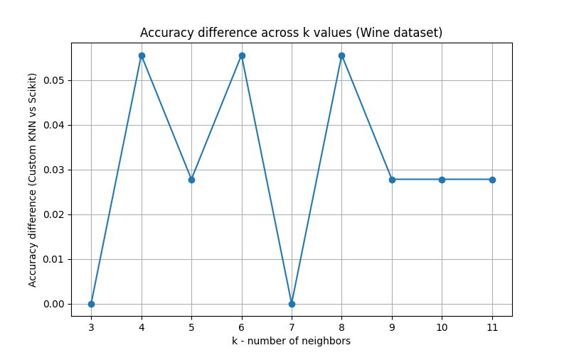
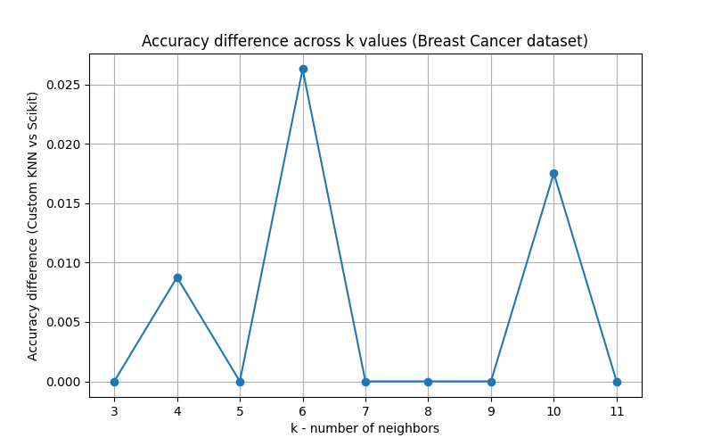

# Analysis of K-NN Implementation
## Comparison with scikit-learn

The custom K-NN implementation was tested against scikit-learn’s `KNeighborsClassifier` on two standard datasets: **Wine** and **Breast Cancer**. The purpose was to evaluate how closely the custom implementation approximates scikit-learn in terms of classification accuracy.

---

## Wine Dataset
- Accuracy difference between the custom K-NN and scikit-learn remained **very low**, generally between `0.00` and `0.05`.
- This indicates the custom implementation performs almost identically to scikit-learn for this dataset.
- Minor differences are likely due to random train-test splits settings.
- **Conclusion:** Custom K-NN is reliable and closely aligned with scikit-learn on the Wine dataset.

    <em>
        Figure 1: Accuracy Difference across k values (Wine dataset)
        Own Work</a>
    </em>

---

## Breast Cancer Dataset
- Accuracy differences were even smaller, in the range of `0` to `0.025`.
- **Conclusion:** The custom K-NN implementation performs consistently with scikit-learn for this dataset.

    <em>
        Figure 2: Accuracy Difference across k values (Breast Cancer dataset)
        Own Work</a>
    </em>

---

## Overall Analysis
- Across both datasets, the custom implementation demonstrates **strong alignment** with scikit-learn results.
- Differences are minimal and do not significantly impact classification performance.
- This confirms that the algorithm is correctly implemented and suitable for small- to medium-sized classification tasks.

---

## References
- [scikit-learn KNeighborsClassifier Documentation](https://scikit-learn.org/stable/modules/generated/sklearn.neighbors.KNeighborsClassifier.html)
- [K-Nearest Neighbors Algorithm Overview](KNN_OVERVIEW.md)
