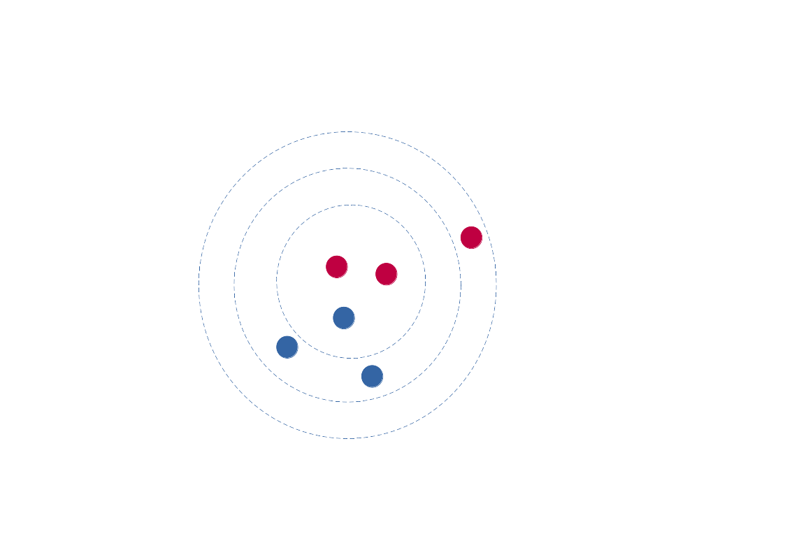
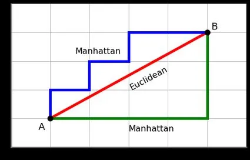

# K-Nearest Neighbors Algorithm Overview

## What is it?
K-NN is a non-parametric supervised learning method. Most often, it is used for `classification` purposes.

- supervised learning - machine learning method in which algorithm uses a mapping of input data features to predict the output labels.
- non-parametric - making decisions purely on training data (no explicit parameters).
- classification - prediction of discrete labels for new data points.

## How does it work?
K-NN operates on the assumption that `similar data points are located near each other and can be grouped to the same category, based on their proximity to eachother.` Algorithm already having some labeled data can check the distances of a new input and then label it accordingly. **Before the classification can be made - a distance has to be defined**

    <em>
        Figure 1: K-Nearest Neighbors visualization. Source: 
        <a href="https://www.linkedin.com/pulse/k-nearest-neighbors-knn-algorithm-classification-nrxgf">
        Vrata Tech Solutions Pvt. Ltd. (LinkedIn)</a>
    </em>

## K-NN Requirements

- **Distance metric**
- How many neighbors to check in order to determine the classification of a specific point (**K Variable**)

Most popular distance metric types are Euclidean distance or Manhattan distance. K value should depend on an input data - in high noise sets, it is recommended to use higher K value. Additionally choice of an **odd K** number is recommended, as it simplifies the "tie" situations.

## Distance Metric

    <em>
        Figure 2: K-Nearest Neighbors labelling based on distance metric evaluation. Source:
      <a href="https://medium.com/analytics-vidhya/k-nn-from-scratch-212dcff13eb3">
        Neto Figueira (Medium)
      </a>  
    </em>

The main purpose of a distance metric is to `calculate distance between "query point" (new input data) and already labeled data points` in the set. This calculation enables a selection of **K** nearest neighbors.

    <em>
        Figure 3: K-Nearest Neighbors distance metric visualization. Source:
      <a href="https://pub.aimind.so/refining-knn-regressor-optimizing-model-fit-with-distance-metrics-edd5a59ef291">
        Nimisha Singh (Medium)
      </a>  
    </em>

### Euclidean Distance
The length of the line between two points.
$$d(x, y) = \sqrt{\sum_{i=1}^{n} (x_i - y_i)^2}$$

### Manhattan (Taxicab) Distance
Distance between any two points equals the length of their shortest grid path.

$$d(p,q) = \sum_{i=1}^{n} |p_{i} - q_{i}| $$

"Distance between two points 
$\mathbf{p} = (p_1, p_2, \dots, p_n)$ and $\mathbf{q} = (q_1, q_2, \dots, q_n)$ 
in an $n$-dimensional real coordinate space is the sum of the absolute differences of their coordinates"

> *[Taxicab geometry, Wikipedia](https://en.wikipedia.org/wiki/Taxicab_geometry)*

## Strengths and Weaknesses

| Strengths | Weaknesses |
| :---:       | :---:     |
| **+ Straightforward implementation**         | **- Does not Scale Well (in big datasets)**       |
| **+ Only a Few Hyper Parameters** | **- Does not perform well with dimensional data**    |
| **+ Adaptable to new data**      | **- Overfitting (too low K values can overfit the data, while too high K can smooth out the predictions)** |

## Use Cases
- Data Preprocessing (missing data computations)
- Finance (stock market forecasting)
- Recommendation Algorithms

### Sources:
[Wikipedia Article: k-nearest neighbors algorithm](https://en.wikipedia.org/wiki/K-nearest_neighbors_algorithm)

[IBM Technology: What is the K-Nearest Neighbor (KNN) Algorithm?](https://www.youtube.com/watch?v=b6uHw7QW_n4)