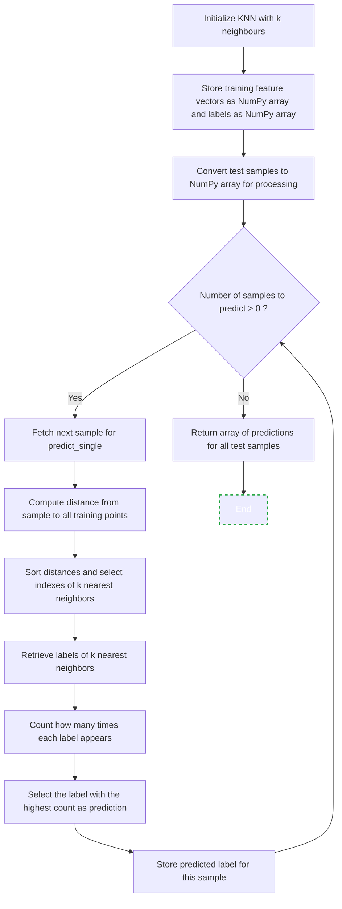

# State Diagram
## K-NN implementation

```mermaid 
flowchart TD
    A1[Initialize KNN with k neighbours] --> A2

    A2[Store training feature vectors as NumPy array and labels as NumPy array] --> A3

    A3[Convert test samples to NumPy array for processing] --> B1

    B1{Number of samples to predict > 0 ?} --> |Yes| C1
    B1 --> |No| D1

    C1[Fetch next sample for predict_single] --> C2
    C2[Compute distance from sample to all training points] --> C3
    C3[Sort distances and select indexes of k nearest neighbors] --> C4
    C4[Retrieve labels of k nearest neighbors] --> C5
    C5[Count how many times each label appears] --> C6
    C6[Select the label with the highest count as prediction] --> C7
    C7[Store predicted label for this sample] --> B1

    D1[Return array of predictions for all test samples] --> E1[End]
    style E1 stroke:#28a745,stroke-width:2px,color:#fff,stroke-dasharray: 5 5


```
